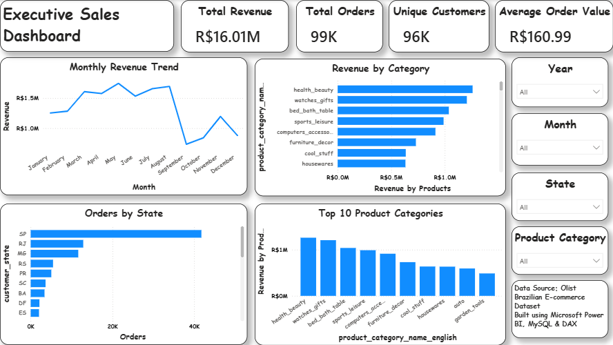
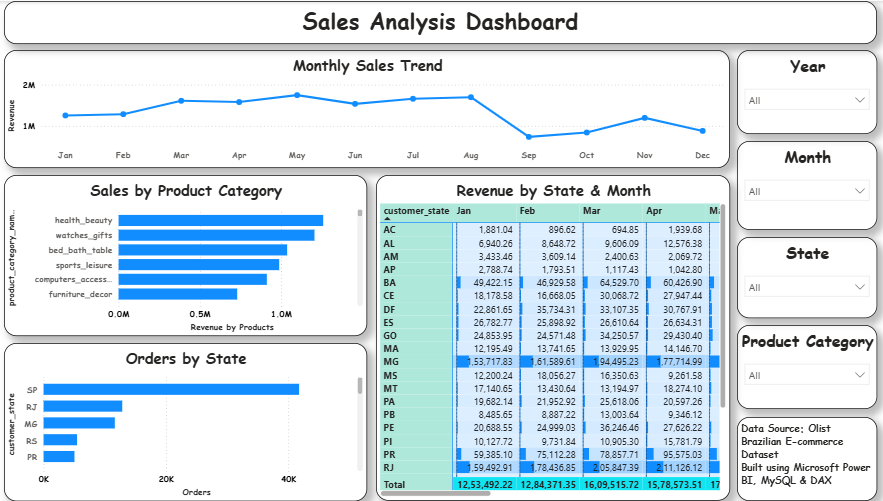
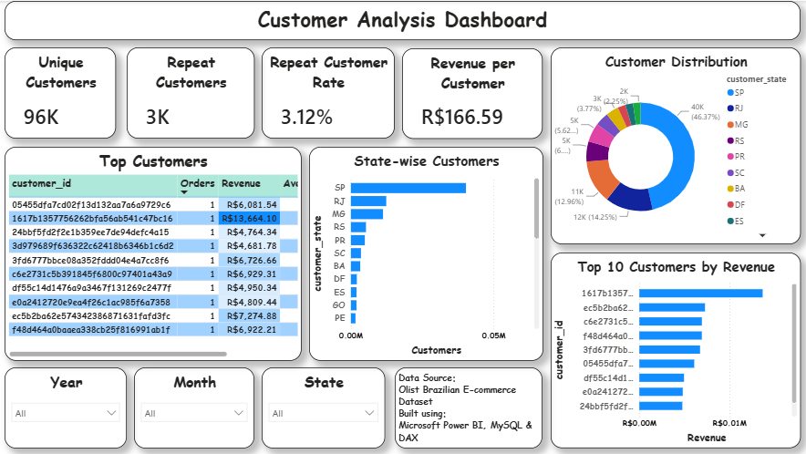
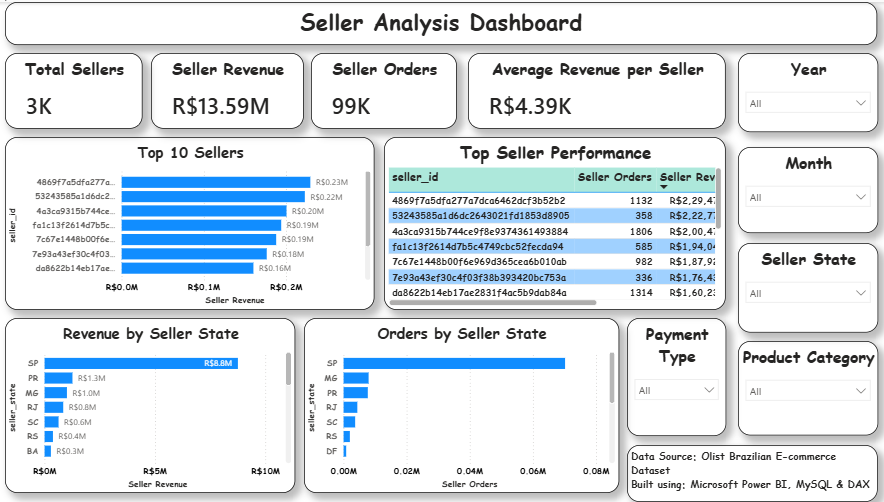
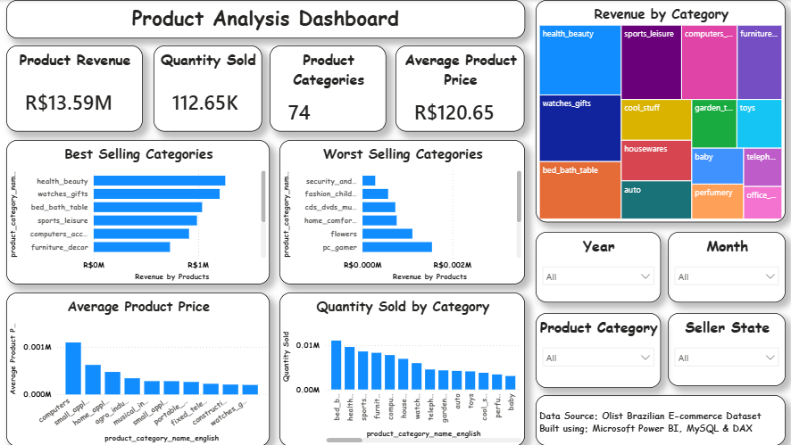

# 🛒 Brazilian E-Commerce Data Analysis using SQL & Power BI


## 📌 Project Overview

This project analyzes the **Brazilian E-Commerce Public Dataset by Olist** using **MySQL** for data analysis and **Power BI** for interactive dashboard visualization.

The objective is to uncover valuable business insights related to sales performance, customer behavior, seller performance, payment methods, product categories, and delivery efficiency.

---

## 📂 Dataset Description

**Dataset:** Brazilian E-Commerce Public Dataset by Olist

The dataset contains information about:

- Customers
- Orders
- Order Items
- Products
- Sellers
- Payments
- Reviews
- Geolocation
- Product Category Translation

The original data consists of multiple related tables connected through primary and foreign keys.

---

### Dataset Statistics

- 📦 99,000+ Orders
- 👥 99,000+ Customers
- 🏪 3,000+ Sellers
- 📦 32,000+ Products
- ⭐ 99,000+ Reviews
- 💳 100,000+ Payments

---

## 🗄 Database Schema (ER Diagram)


---

## ❓ SQL Business Questions

### Sales Analysis

- Total Revenue
- Monthly Sales Trend
- Average Order Value

### Customer Analysis

- Top Customers
- Customer Distribution by State
- Repeat Customers

### Seller Analysis

- Top Sellers
- Seller Revenue
- Seller Order Count

### Product Analysis

- Top Categories
- Best-selling Products
- Category Revenue

### Delivery Analysis

- Average Delivery Time
- Late Deliveries

### Payment Analysis

- Payment Methods
- Installment Analysis

---

## 📊 Power BI Dashboard

The interactive dashboard includes:

- Executive Overview
- Sales Analysis
- Customer Analysis
- Seller Analysis
- Product Analysis

Dashboard Features

✔ Interactive Filters

✔ KPI Cards

✔ Drill-through Reports

✔ Dynamic DAX Measures

✔ Trend Analysis

✔ Category Comparison

---

## 📸 Dashboard Screenshots

### Executive Overview



---

### Sales Analysis



---

### Customer Analysis



---

### Seller Analysis



---

### Product Analysis



---

## 📊 Project Highlights

- 💰 Total Revenue: **R$16.01M**
- 📦 Total Orders: **99K**
- 👥 Unique Customers: **96K**
- 🛍 Product Categories: **74**
- 🏪 Total Sellers: **3K**
- 🔁 Repeat Customer Rate: **3.12%**
- 💵 Average Order Value: **R$160.99**
- 💳 Average Revenue per Customer: **R$166.59**

---

## 💡 Key Insights

#### 📈 Sales Insights

- The platform generated **R$16.01M** in total revenue from approximately **99K orders** placed by **96K unique customers**.
-  Sales peaked during the **March–August period**, indicating strong mid-year demand, while a noticeable decline occurred in **September** before recovering toward the end of the year.
- **São Paulo (SP)** contributed the highest number of orders and generated the largest share of revenue among all Brazilian states.

#### 🛍 Product Insights

- The **Health & Beauty category** generated the highest revenue, followed by **Watches & Gifts**, **Bed, Bath & Table**, and **Sports & Leisure**.
- The dataset contains **74 product categories**, showing a diverse product portfolio.
- The average product price was approximately **R$120.65**, indicating that most purchases were in the affordable to mid-range price segment.
- Product revenue is concentrated in a small number of high-performing categories, while several categories contribute only a minor share of total sales.

#### 👥 Customer Insights

- The platform served approximately 96K unique customers, with around **3K repeat customers**, resulting in a **3.12% repeat customer** rate.
- The average revenue generated per customer was **R$166.59**.
- Customer distribution is heavily concentrated in **São Paulo (SP)**, followed by Rio de Janeiro (RJ) and Minas Gerais (MG).
- A relatively small number of customers generated the highest individual revenues, highlighting opportunities for customer retention and loyalty programs.

#### 🏪 Seller Insights

- More than **3K sellers** participated in the marketplace, generating approximately **R$13.59M** in product revenue.
- The average revenue per seller was approximately **R$4.39K**.
- Sellers located in **São Paulo (SP)** generated the highest revenue and fulfilled the largest number of orders.
- Revenue distribution among sellers is uneven, with a small group of top-performing sellers contributing a significant portion of total sales.

---

## 📈 Business Recommendations

- **Increase customer retention** by introducing loyalty programs and personalized offers to improve the repeat customer rate.
- **Expand successful product categories**, such as Health & Beauty and Watches & Gifts, through targeted marketing and inventory optimization.
- **Support sellers in lower-performing states** with promotional campaigns and training to improve regional sales performance.
- **Optimize inventory planning** ahead of peak sales months to meet increased customer demand.
- **Focus marketing efforts on high-performing regions**, while exploring growth opportunities in states with lower customer penetration.
- **Strengthen relationships with top-performing sellers** by providing incentives, exclusive campaigns, and performance-based rewards.
- **Monitor under-performing product categories** to determine whether they should be improved, re-positioned, or phased out.

---

## 📁 Repository Structure

```
Brazilian-Ecommerce-Data-Analysis/
│
├── Dataset/
│   ├── olist_customers_dataset.csv
│   ├── olist_orders_dataset.csv
│   ├── olist_order_items_dataset.csv
│   ├── olist_order_payments_dataset.csv
│   ├── olist_order_reviews_dataset.csv
│   ├── olist_products_dataset.csv
│   ├── olist_sellers_dataset.csv
│   ├── olist_product_category_name_translation.csv
│   ├── olist_geolocation_dataset.csv
│   └── data_dictionary.md
│
├── SQL/
│   ├── 01_Create_Database.sql
│   ├── 02_Import_Data.sql
│   ├── 03_Foreign_Keys.sql
│   ├── 04_Data_Cleaning.sql
│   ├── 05_Data_Analysis.sql
|   ├── 06_Data_Analysis.sql
|   ├── 07_Data_Analysis.sql
│   └── 08_Data_Analysis.sql
│
├── PowerBI/
│   └── ecommerce_project.pbix
│
├── Images/
│   ├── executive-sales-dashboard.png
│   ├── sales-analysis-dashboard.png
│   ├── customer-analysis-dashboard.png
│   ├── seller-analysis-dashboard.png
│   ├── product-analysis-dashboard.png
│   └── ER_Diagram.png
│
├── README.md
├── LICENSE
└── .gitignore
```

---

## 🚀 Skills Demonstrated

- SQL Joins
- Common Table Expressions (CTEs)
- Window Functions
- Aggregate Functions
- Data Cleaning
- Data Modeling
- Foreign Keys
- Power Query
- DAX Measures
- Data Visualization
- Dashboard Design

---

| Tool | Purpose |
|------|---------|
| MySQL | Database Management |
| SQL | Data Analysis |
| Power BI | Dashboard & Visualization |
| Power Query | Data Transformation |
| DAX | Calculated Measures |
| Git | Version Control |
| GitHub | Project Hosting |

---

## ▶️ How to Run the Project

1. Clone this repository.
2. Create the database and all tables using `01_Create_Database.sql`.
3. Import the dataset using `02_Import_Data.sql`.
4. Create Foreign Keys using `03_Foreign_Keys.sql`.
5. Perform data cleaning using `04_Data_Cleaning.sql`.
6. Execute `05_Data_Analysis.sql`, `06_Data_Analysis.sql`, `07_Data_Analysis.sql` and `08_Data_Analysis.sql` to generate business insights.
7. Open `ecommerce_project.pbix` in Power BI Desktop to explore the interactive dashboard.

---

## 👩‍💻 Author

**Aysha Rafiya**

- Electronics & Communication Engineering Graduate
- Aspiring Data Analyst
- Skilled in SQL, Power BI, Excel, Python, and Data Analytics

---

## ⭐ If you found this project useful, consider giving it a star!
