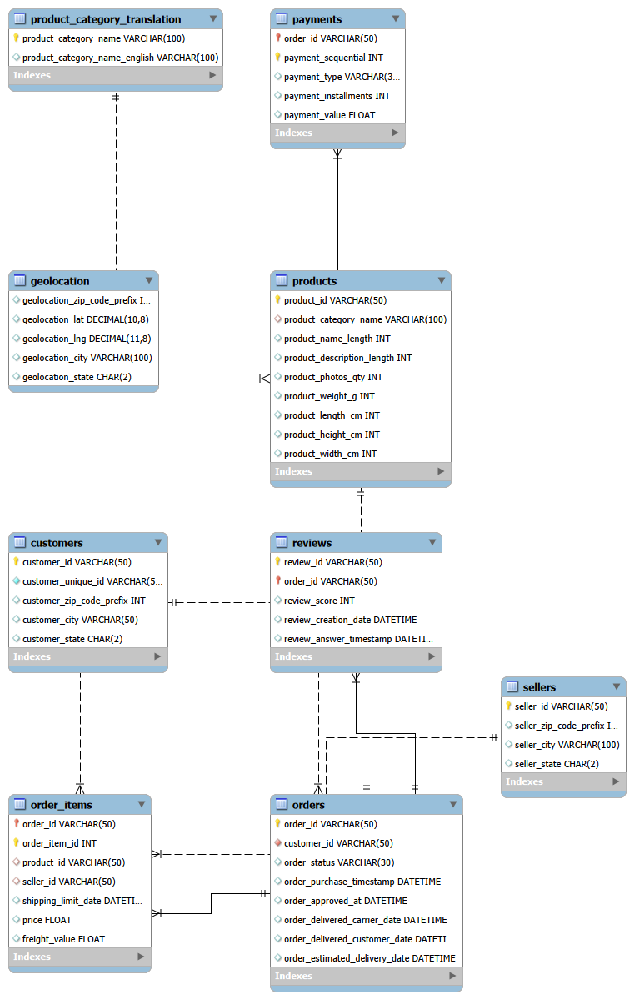

# 🛒 Brazilian E-Commerce Data Analysis using SQL & Power BI

## 📌 Project Overview

This project analyzes the **Brazilian E-Commerce Public Dataset by Olist** using **MySQL** for data analysis and **Power BI** for interactive dashboard visualization.

The objective is to uncover valuable business insights related to sales performance, customer behavior, seller performance, payment methods, product categories, and delivery efficiency.

---

## 📂 Dataset Description

**Dataset:** Brazilian E-Commerce Public Dataset by Olist

The dataset contains information about:

- Customers
- Orders
- Order Items
- Products
- Sellers
- Payments
- Reviews
- Geolocation
- Product Category Translation

The original data consists of multiple related tables connected through primary and foreign keys.

---

## 🗄 Database Schema (ER Diagram)



---

## ❓ SQL Business Questions

This project answers several business questions, including:

- What is the total revenue generated?
- Which states generate the highest revenue?
- What are the monthly sales trends?
- Who are the top-performing sellers?
- Which product categories generate the highest sales?
- What payment methods are most frequently used?
- Which customers spend the most?
- How long do deliveries take on average?
- Which orders were delivered late?
- What are the customer review trends?
- Which products generate the highest revenue?

More than **30 business queries** were solved using SQL.

---

## 📊 Power BI Dashboard

The interactive dashboard includes:

- Executive Overview
- Sales Analysis
- Customer Analysis
- Seller Analysis
- Product Analysis
- Payment Analysis
- Delivery Performance

---

## 📸 Dashboard Screenshots

### Dashboard Overview


---

### Sales Analysis


---

### Customer Analysis


---

### Seller Analysis


---

### Product Analysis


---

## 💡 Key Insights

- Revenue is concentrated in a few major Brazilian states.
- Credit Card is the most preferred payment method.
- A small percentage of sellers contribute significantly to total revenue.
- Some product categories consistently outperform others.
- Most deliveries are completed on time, while delayed deliveries negatively impact customer ratings.
- Customers who receive orders on time generally provide higher review scores.

---

## 📈 Business Recommendations

- Increase marketing efforts in high-performing states.
- Improve logistics to reduce late deliveries.
- Reward top-performing sellers through incentive programs.
- Promote high-revenue product categories.
- Encourage digital payment methods for faster processing.
- Monitor customer reviews regularly to improve satisfaction.

---

## 📁 Repository Structure

```
Brazilian-Ecommerce-Data-Analysis/
│
├── Dataset/
│   ├── olist_dataset.csv
│   └── data_dictionary.md
│
├── SQL/
│   ├── 01_Create_Database.sql
│   ├── 02_Create_Tables.sql
│   ├── 03_Import_Data.sql
│   ├── 04_Data_Cleaning.sql
│   └── 05_Data_Analysis.sql
│
├── PowerBI/
│   └── Ecommerce_Dashboard.pbix
│
├── Images/
│   ├── Dashboard_Overview.png
│   ├── Sales_Analysis.png
│   ├── Customer_Analysis.png
│   ├── Seller_Analysis.png
│   ├── Product_Analysis.png
│   └── ER_Diagram.png
│
├── README.md
├── LICENSE
└── .gitignore
```

---

## 🛠 Tools Used

- MySQL
- SQL
- Power BI
- Power Query
- DAX
- Git
- GitHub

---

## ▶️ How to Run the Project

1. Clone this repository.
2. Create the database using `01_Create_Database.sql`.
3. Create all tables using `02_Create_Tables.sql`.
4. Import the dataset using `03_Import_Data.sql`.
5. Perform data cleaning using `04_Data_Cleaning.sql`.
6. Execute `05_Data_Analysis.sql` to generate business insights.
7. Open `Ecommerce_Dashboard.pbix` in Power BI Desktop to explore the interactive dashboard.

---

## 👩‍💻 Author

**Aysha Rafiya**

- Electronics & Communication Engineering Graduate
- Aspiring Data Analyst
- Skilled in SQL, Power BI, Excel, Python, and Data Analytics

---

## ⭐ If you found this project useful, consider giving it a star!
